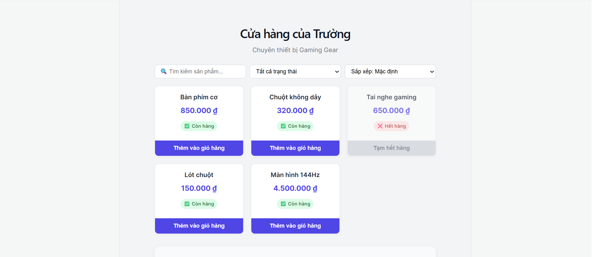
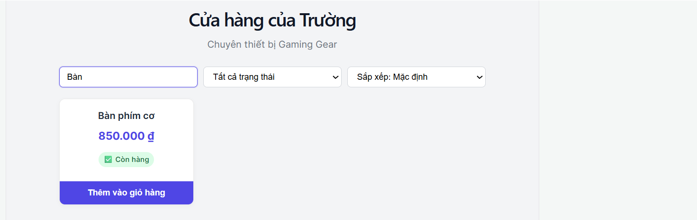
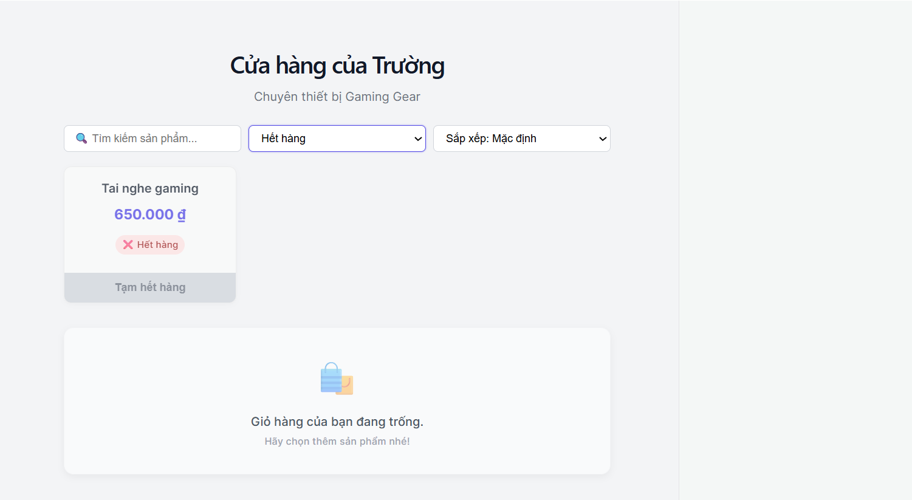
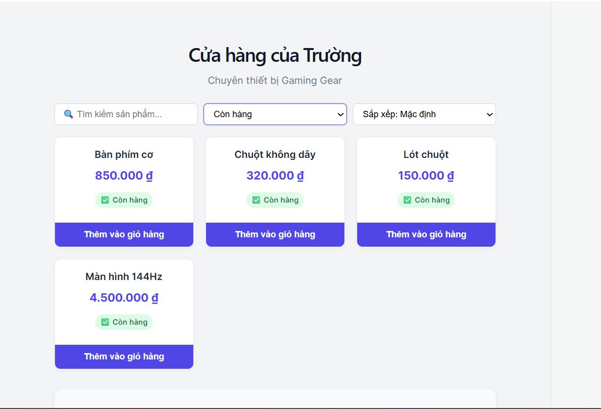
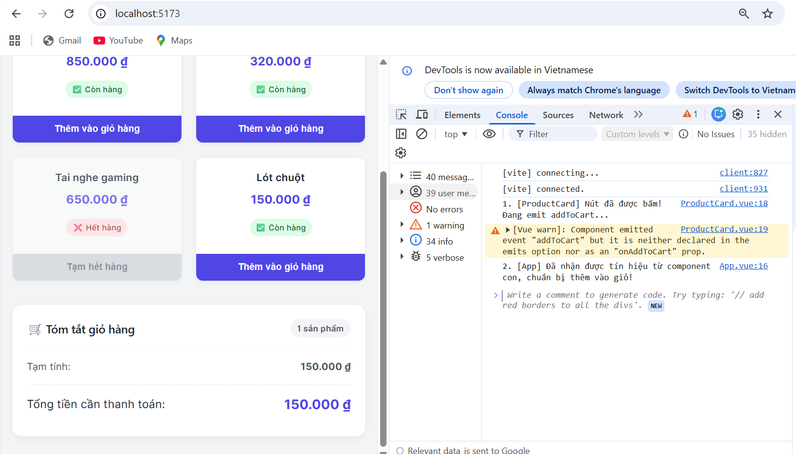
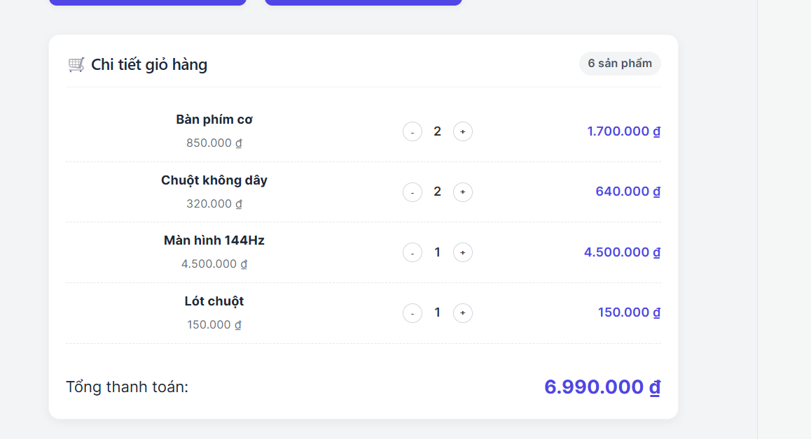

# Lab 02 --- Vue Component, Props, Emit và Event Handling

## Thông tin sinh viên

  Hạng mục   Chi tiết
  ---------- -------------------
  Họ tên     Kiều Quang Trường
  MSSV       1771020696
  Lớp        CNTT 17-13
  Ngày nộp   12/05/2026

------------------------------------------------------------------------

## Cách chạy project

``` bash
npm install
npm run dev
```

------------------------------------------------------------------------

## Chức năng / AI hỗ trợ / Sinh viên tự làm

### 🔹 Chức năng đã hoàn thành

-   Hiển thị danh sách sản phẩm bằng `v-for`.
-   Vô hiệu hóa nút **"Thêm vào giỏ"** nếu sản phẩm hết hàng.
-   Thêm sản phẩm vào giỏ hàng.
-   Tính tổng số lượng và tổng tiền (dùng `computed`).
-   \[Mở rộng\] Tìm kiếm sản phẩm theo tên.
-   \[Mở rộng\] Lọc sản phẩm theo trạng thái (Còn hàng / Hết hàng).
-   \[Mở rộng\] Sắp xếp sản phẩm theo giá (Tăng / Giảm).
-   \[Mở rộng\] Hiển thị chi tiết giỏ hàng và có nút tăng/giảm số lượng
    (+/-).

------------------------------------------------------------------------

### 🤖 Phần AI hỗ trợ

-   Tạo scaffold cho:
    -   `App.vue`
    -   `ProductCard.vue`
    -   `CartSummary.vue`
-   Cung cấp CSS cơ bản (grid + UI).
-   Hướng dẫn:
    -   Dùng `reduce` để tính tổng tiền
    -   Kết hợp `v-model` với `computed` để lọc dữ liệu

------------------------------------------------------------------------

### 🧑‍💻 Phần sinh viên tự làm

-   Tự hiểu luồng dữ liệu:
    -   Props (cha → con)
    -   Emit (con → cha)
-   Lắp ghép component vào `App.vue`
-   Debug bằng `console.log()`
-   Tự sửa lỗi event
-   Áp dụng các chức năng mở rộng

------------------------------------------------------------------------

### 🐞 Lỗi đã gặp và cách sửa

**Lỗi:**\
Bấm "Thêm vào giỏ hàng" nhưng không có phản hồi.

**Nguyên nhân:**\
- Component con emit: `addToCart` (camelCase)\
- Component cha lắng nghe: `@add-to-cart` (kebab-case)\
- HTML tự chuyển về lowercase → mismatch

**Cách sửa:**\
→ Đổi event emit thành `add-to-cart` (kebab-case) trong
`ProductCard.vue`

------------------------------------------------------------------------

### 📚 Phần hiểu rõ nhất

-   Cấu trúc component trong Vue 3
-   Dùng `ref` để quản lý state
-   Nguyên tắc: Data Down, Events Up
-   Tầm quan trọng của `:key` trong `v-for`

------------------------------------------------------------------------

### ❗ Phần chưa chắc

-   Kết hợp nhiều bộ lọc trong `computed`:
    -   search + filter + sort cùng lúc\
        → Cần luyện thêm

------------------------------------------------------------------------

## Link minh chứng

  Hạng mục            Chi tiết
  ------------------- ----------------------------------------------
  Link GitHub         (https://github.com/2bllikigai/Lab2_FullStack)
  Ảnh Trang chủ   
  Ảnh Tìm kiếm   
  Ảnh Lọc Theo hết hàng   
  Ảnh Lọc Theo còn hàng   
  Ảnh Debug   
  Ảnh Chi tiết giỏ hàng   
